# Progetto_OOP
Con tale progetto ci si propone di realizzare, tramite framework SpringBoot, un Web Service che permetta ad un Client di effettuare operazioni REST API del tipo GET o POST.
L'applicazione andrà a studiare gli eventi che avranno luogo in Canada, sfruttando le API del sito ticketmaster. 
## Start
E' possibile avviare l'applicazione direttamente dal nostro IDE, importando tale repository e mandando in run tramite 'Run As: SpringBoot App'. A questo punto l'applicazione è in ascolto
alla porta http://localhost:8080/

## Modello 
Ogni evento è descritto da diverse proprietà:
- Nome dell'evento
- Genere dell'evento
- Data dell'evento
- Luogo dell'evento
- Città in cui si terrà l'evento
- Stato in cui si terrà l'evento
- Paese in cui si terrà l'evento

## Richieste
Il client ha la possibilità di inviare diversi tipi di richieste:
- `GET /events` Ottenere la lista di tutti gli eventi in programmazione
- `POST /filteredEvents` Ottenere una lista di eventi filtrati in base a parametri scelti
- `GET /stats/state` Ottenere delle statistiche sul numero di eventi in ogni stato
- `GET /stats/seg` Ottenere delle statistiche sul numero di eventi in ogni stato, raggruppati per genere
- `POST /stats/per` Ottenere delle statistiche riguardo al numero massimo, minimo e medio di eventi in un certo periodo.
#### Esempi
**GET /events**
Esempio di risposta: 
```
[
    {
        "name": "Wardruna",
        "segment": "Music",
        "date": "2021-10-09",
        "venue": "Chan Centre for the Performing Arts",
        "city": "Vancouver",
        "state": "British Columbia",
        "country": "Canada"
    },
    ...
]
```
**POST /filteredEvents**
Esempio Body della richiesta:
```
    {
        "State":["Ontario"],
        "Segment":["Music"]
    }

```
Risposta: 
```
[
    {
        "name": "The Doobie Brothers - 50th Anniversary Tour",
        "segment": "Music",
        "date": "2021-08-26",
        "venue": "Budweiser Gardens",
        "city": "London",
        "state": "Ontario",
        "country": "Canada"
   },
   ...
]
   
```
**GET /stats/state**
Esempio di risposta:
```
{
    "New Brunswick": 11,
    "Manitoba": 43,
    "Prince Edward Island": 1,
    "Alberta": 113,
    "Nova Scotia": 3,
    "Quebec": 462,
    "British Columbia": 97,
    "Saskatchewan": 14,
    "Ontario": 254,
    "Newfoundland and Labrador": 2
}
```
**GET /stats/seg**
Esempio di risposta:
```
{
    "New Brunswick": {
        "Music": 3,
        "Sports": 8
    },
    "Manitoba": {
        "Music": 30,
        "Arts & Theatre": 13
    },
    "Prince Edward Island": {
        "Music": 1
    },
    "Alberta": {
        "Miscellaneous": 1,
        "Film": 2,
        "Music": 66,
        "Arts & Theatre": 24,
        "Sports": 20
    },
    "Nova Scotia": {
        "Music": 3
    },
    "Quebec": {
        "Film": 22,
        "Music": 225,
        "Arts & Theatre": 178,
        "Sports": 37
    },
    "British Columbia": {
        "Music": 57,
        "Arts & Theatre": 15,
        "Sports": 25
    },
    "Saskatchewan": {
        "Music": 13,
        "Sports": 1
    },
    "Ontario": {
        "Miscellaneous": 3,
        "Music": 139,
        "Arts & Theatre": 97,
        "Sports": 15
    },
    "Newfoundland and Labrador": {
        "Music": 2
    }
}
```
**POST /stats/per**
Esempio body della richiesta: 
```
{
    "stats":"DateMonth"
}
```
Risposta: 
```
{
    "New Brunswick": {
        "Media mensile": 0,
        "Massimo mensile": 6,
        "Minimo mensile": 0
    },
    "Manitoba": {
        "Media mensile": 0,
        "Massimo mensile": 6,
        "Minimo mensile": 0
    },
    "Prince Edward Island": {
        "Media mensile": 1,
        "Massimo mensile": 6,
        "Minimo mensile": 0
    },
    "Alberta": {
        "Media mensile": 1,
        "Massimo mensile": 6,
        "Minimo mensile": 0
    },
    "Nova Scotia": {
        "Media mensile": 1,
        "Massimo mensile": 6,
        "Minimo mensile": 0
    },
    "Quebec": {
        "Media mensile": 1,
        "Massimo mensile": 6,
        "Minimo mensile": 0
    },
    "British Columbia": {
        "Media mensile": 1,
        "Massimo mensile": 6,
        "Minimo mensile": 0
    },
    "Saskatchewan": {
        "Media mensile": 2,
        "Massimo mensile": 6,
        "Minimo mensile": 0
    },
    "Ontario": {
        "Media mensile": 23,
        "Massimo mensile": 51,
        "Minimo mensile": 0
    },
    "Newfoundland and Labrador": {
        "Media mensile": 23,
        "Massimo mensile": 51,
        "Minimo mensile": 0
    }
}
```
## Filtri
|     CAMPO      |FUNZIONE                                              |ESEMPIO                                           |
|----------------|------------------------------------------------------|--------------------------------------------------|
|State           |Ottengo eventi che si svolgono nello stato specificato|`{"State":["Ontario"]}`                           |
|Segment         |Ottengo eventi del genere specificato                 |`{"Segment":["Music"]}`                           |
|DateDay         |Ottengo eventi che si svolgono nel giorno specificato |`{"DateDay":["2021-06-25"]}`                      |
|DateMonth       |Ottengo eventi che si svolgono nel mese specificato   |`{"DateMonth":["2021-03"]}`                       |
|DateYear        |Ottengo eventi che si svolgono nell'anno specificato  |`{"DateYear":["2021"]}`                           |

E' inoltre possibile applicare più filtri contemporaneamente. Ad esempio...
```
{
    "Segment":["Music"],
    "State":["Ontario"],
    "DateMonth":["2021-03"]
}
```
O anche ... 
```
{
    "Segment":["Music","Sports"],
    "State":["Ontario","Quebec"]
}
```

## Diagrammi UML
### Diagramma dei casi d'uso
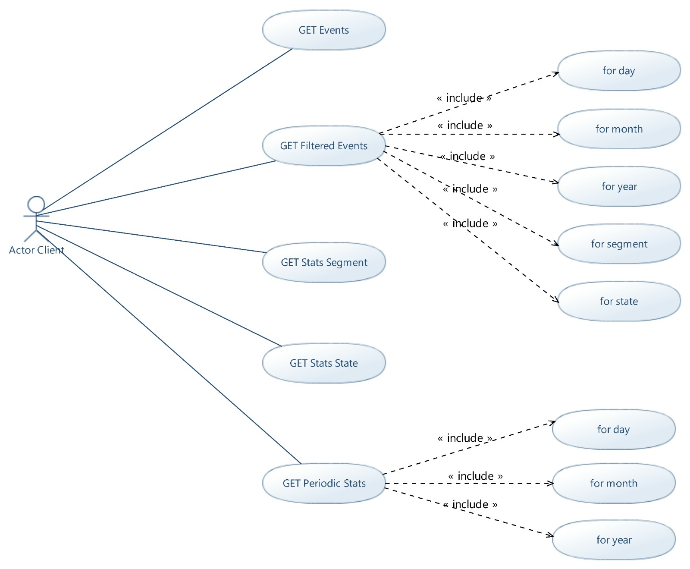

### Packages
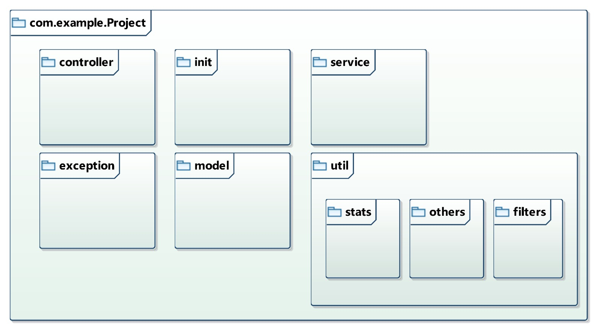

### Diagrammi delle classi

**com.example.Project.controller**

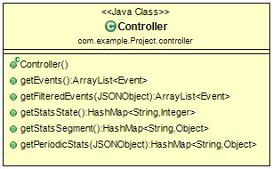

**com.example.Project.exception**

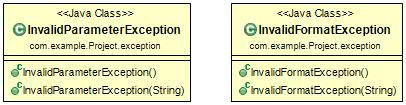

**com.example.Project.init**

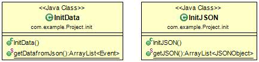

**com.example.Project.model**

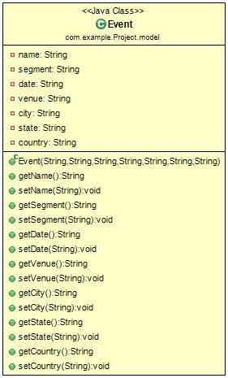

**com.example.Project.service**

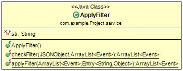

**com.example.Project.util.filters**

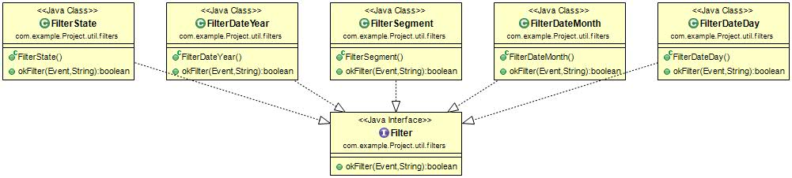

**com.example.Project.util.other**

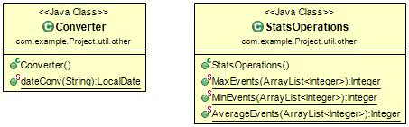

**com.example.Project.util.stats**

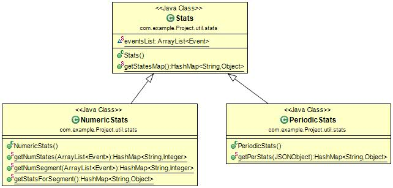


### Diagramma delle sequenze

**GET /events**

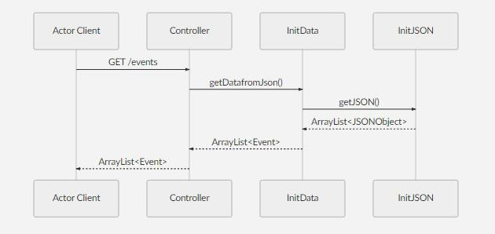

**POST /filteredEvents**

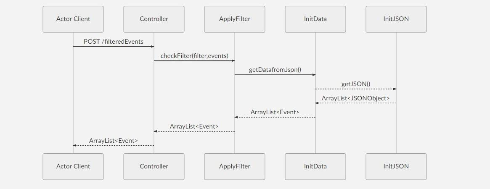

**GET /stats/state**

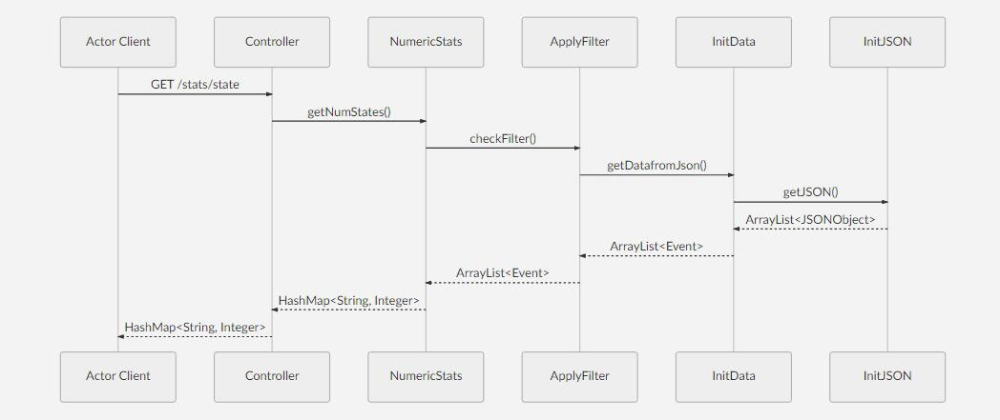

**GET /stats/seg**

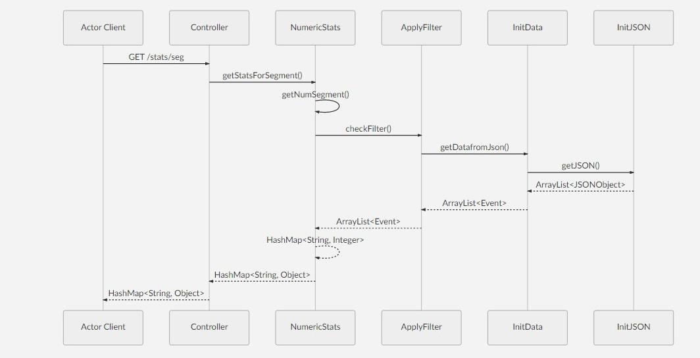

**GET /stats/per**

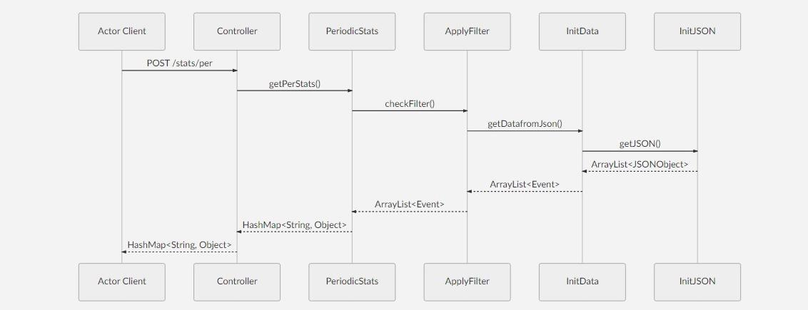


## Autori
- Matteo Andrenacci : https://github.com/MatteoAndrenacci
- Eleonora Brasili : https://github.com/EleonoraBrasili


